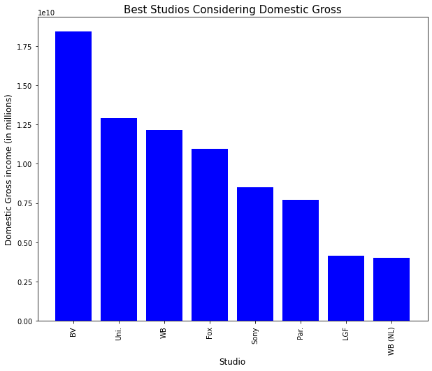

# MICROSOFT FILM STUDIO 

## OVERVIEW
Microsoft have decided to create a new movie studio, but they don’t know anything about creating movies. After exploring what types of films are currently doing the best at the box office. 
Using data from various websites like box office mojo and The numbers.
We recommend Microsoft put a lot of investment into producing movies whose genres are action, adventure, comedy, drama, animation and sci-fi and majorly use English as their original language

## BUSINESS UNDERSTANDING

### Business problem
Microsoft have decided to enter the business of creating original movies, and the task at hand is to help them with important insights and market information to be able to come up with a movie studio that will be profitable and good to their business.

### Business questions
. what type of film genre are performing the best?
. what is the languge used to make films to reach maximum population of people?
. How can microsoft studios make the most profit?

## DATA UNDERSTANDING AND ANALYSIS

### source of data
1."bom.movie_gross.csv" from https://www.boxofficemojo.com/ 
2. "im.db" from https://www.imdb.com/
3. "tn.movie_budgets.csv" from https://www.the-numbers.com/
4. 'tmdb.movies.csv' from https://www.themoviedb.org/

### Description of the data 
1. Our first data for consideration will be "bom.movie_gross.csv" which is data from box office mojo by IMDBpro which is the essential resource for the entertainment industry that helps uncover box office trends and insights and track industry trends
2. The second data in our analysis will be "im.db" which is a database form IMDb which is a website for entertainment fans that has information about movies in details
3. Next we will use "tn.movie_budgets.csv" which is data from "The numbers" a website that shows how much movies in the box office are making this will help us know whether movie studio will be profitable or which movies are making the most.
4. Our next data set will be 'tmdb.movies.csv' which is a dataset from The Movie Database (TMDB) which is a community built movie and TV database. containing data dating back to 2008. TMDB's strong international focus and breadth of data is large that is why analysing it will help microsoft studios come up with a studio that will meet market needs

## Data visualization
We used the following data visualizations

## Conclusion
1. Over the years the domestic gross generated from movies has been increasing thus investing in a movie studio would be a good move for our stake holders.
2.Microsoft may choose to partner with BV,Uni.,WB, Fox and Sony studios because they made the best domestic gross so money invested in a movie together with these companies is likely to generate more profits.
3.There is no relationship between the length of title of a movie and its income return therefore microsoft can make their movie titles as creative as they wish.
4 .Microsoft should consider making Action,Adventure,Sci-Fi Action,Adventure,Fantasy Adventure,Animation,Comedy Drama Comedy,Drama,Romance Action,Adventure,Comedy movies because they had over 7 million votes which means most people would prefer them
5. An increase in production budget also increases profit and worldwide gross income so to make more money mocrosoft will have to put more money in to production
6. Movies whose original language is (en) english got most votes but also among best selling languages are (fr) French (ja) Japanese (es) Spanish (it) Italian (de) German (ko) Korean which also had above 10000 votes
7.There is no relationship between vote average and popularity

# RECOMMENDATIONS
From the above analysis and visualization my recomendations are

From the analysis i would recommend microsoft to largely focus on producing; action, adventure, comedy, drama, animation and sc-fi as their main genres of movies because they got the most votes meaning people preffered them.

I would recommend microsoft to focus on majorly producing most of their movies with english as their original language because most people voted for movies whose original language is english.

I would recomend microsoft to invest more into movie production budget, Microsoft may choose to partner with BV,Uni.,WB, Fox and Sony studios because it will in return give higher profits because they are the best selling movie studios.